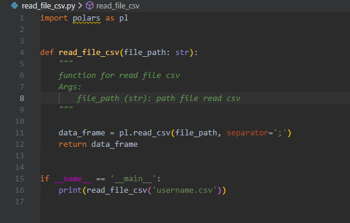

# Documentation

Case Assignment ini adalah case untuk membuat sebuah fungsi yang bisa membaca file dari `username.csv`. Untuk menjalankan fungsi ini diperlukan package library yang ada di file `requirements.txt`. Tahap menjalankan codenya sebagai berikut:

1. Untuk tahap pertama adalah membuat environment baru dengan cara `python -m venv venv`
2. Ketika environment `venv` sudah dibuat install seluruh library yang ada di file `requirements.txt` dengan cara `pip install -r requirements.txt`
3. Kemudian Jalankan perintah `python read_file_csv.py`

# Documentation Alur Assignment

1. Buatlah satu repository Github dengan nama dibimbing-belajar-github

2. Clone repository tersebut ke local laptop/working directory yang sudah kita siapkan

3. Buatlah satu file python yang berisi tentang function untuk read file csv berikut file csv.

    - Fungsi untuk read file csv
    

    - Hasil dari read file csv
    

4. Membuat branch dengan format feature/<nama_branch>. <nama_branch> bisa diisi bebas

5. Commit new file ke feature/<nama_branch>, lalu push ke repository

    - git add file yang akan di commit
    

    - git commit file yang dipilih
    

    - push ke repository github
    

6. Lalu, buatlah Pull Request di Github untuk merge ke branch master/main

    - Tampilan open pull request
    

    - Tampilan setelah create pull request
    

    - Pull request berhasil
    

    - Hasil branch main
    

7. Yang terakhir lakukan Pull remote master/main branch ke local master/main branch

Author : Muhammad Khairunnas

Email  : heft0305@gmail.com

Assignment : GIT